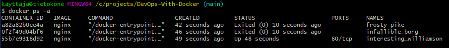
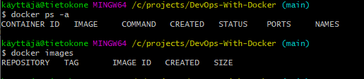
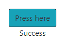
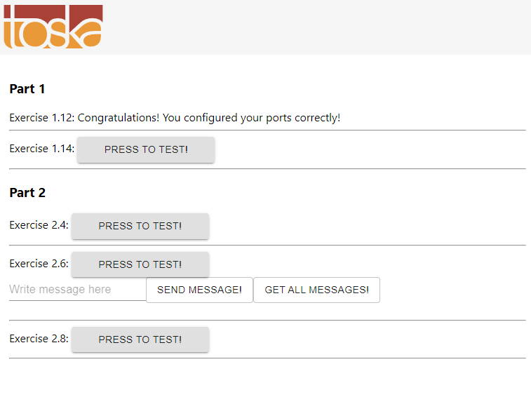
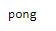

# Part 1

## 1.1


## 1.2


## 1.3
Commands:
* docker run devopsdockeruh/simple-web-service:ubuntu
* docker container ls
* docker start unruffled_kirch
* docker exec -it unruffled_kirch bash
* tail -f ./text.log

Scret message is: 'You can find the source code here: https://github.com/docker-hy'

## 1.4

```bash 
kosti@tietokone:~$ docker run -it ubuntu sh -c 'apt-get update; apt-get install curl -y; echo "Input website:"; read website; echo "Searching.."; sleep 1; curl http://$website;'
...
Input website:
helsinki.fi
Searching..
<!DOCTYPE HTML PUBLIC "-//IETF//DTD HTML 2.0//EN">
<html><head>
<title>301 Moved Permanently</title>
</head><body>
<h1>Moved Permanently</h1>
<p>The document has moved <a href="https://www.helsinki.fi/">here</a>.</p>
</body></html>
```

## 1.5

```bash
kosti@tietokone:~$ docker run devopsdockeruh/simple-web-service:alpine
kosti@tietokone:~$ docker run devopsdockeruh/simple-web-service:ubuntu
kosti@tietokone:~$ docker images
REPOSITORY                          TAG       IMAGE ID       CREATED         SIZE
devopsdockeruh/simple-web-service   ubuntu    4e3362e907d5   11 months ago   83MB
devopsdockeruh/simple-web-service   alpine    fd312adc88e0   11 months ago   15.7MB
kosti@tietokone:~$ docker container ls
CONTAINER ID   IMAGE                                      COMMAND                 CREATED          STATUS         PORTS     NAMES
f230bda9b617   devopsdockeruh/simple-web-service:alpine   "/usr/src/app/server"   10 seconds ago   Up 9 seconds             recursing_ganguly
kosti@tietokone:~$ docker exec -it recursing_ganguly sh
/usr/src/app # ls
server    text.log
/usr/src/app # tail ./text.log
2022-03-04 13:16:20 +0000 UTC
2022-03-04 13:16:22 +0000 UTC
2022-03-04 13:16:24 +0000 UTC
2022-03-04 13:16:26 +0000 UTC
Secret message is: 'You can find the source code here: https://github.com/docker-hy'
```

## 1.6

Found the password from: https://hub.docker.com/r/devopsdockeruh/pull_exercise
```bash
kosti@tietokone:~$ docker run -it devopsdockeruh/pull_exercise
Give me the password: basics
You found the correct password. Secret message is:
"This is the secret message"
```

## 1.7
Dockerfile:
```Dockerfile
FROM devopsdockeruh/simple-web-service:alpine
CMD server
```
Commands:
```bash
kosti@tietokone:~$ docker build . -t web-server
kosti@tietokone:~$ docker run web-server
[GIN-debug] [WARNING] Creating an Engine instance with the Logger and Recovery middleware already attached.

[GIN-debug] [WARNING] Running in "debug" mode. Switch to "release" mode in production.
 - using env:   export GIN_MODE=release
 - using code:  gin.SetMode(gin.ReleaseMode)

[GIN-debug] GET    /*path                    --> server.Start.func1 (3 handlers)
[GIN-debug] Listening and serving HTTP on :8080
```

## 1.8
curl.sh:
```sh
echo "Input website:"; read website; echo "Searching.."; sleep 1; curl http://$website;
```

Dockerfile:
```Dockerfile
FROM ubuntu:20.04

WORKDIR /usr/src/app

COPY curl.sh .

RUN chmod +x curl.sh
RUN apt-get update
RUN apt-get install curl -y

CMD ./curl.sh
```

## 1.9

```bash
kosti@tietokone:~$ cat>logs.txt
^C
kosti@tietokone:~$ sudo docker run -v "$(pwd)/logs.txt:/usr/src/app/text.log" devopsdockeruh/simple-web-service
Starting log output
Wrote text to /usr/src/app/text.log
Wrote text to /usr/src/app/text.log
Wrote text to /usr/src/app/text.log
Wrote text to /usr/src/app/text.log
Wrote text to /usr/src/app/text.log
Wrote text to /usr/src/app/text.log
Wrote text to /usr/src/app/text.log
^Ckosti@tietokone:~$ cat logs.txt
2022-03-12 09:59:46 +0000 UTC
2022-03-12 09:59:48 +0000 UTC
2022-03-12 09:59:50 +0000 UTC
2022-03-12 09:59:52 +0000 UTC
2022-03-12 09:59:54 +0000 UTC
Secret message is: 'You can find the source code here: https://github.com/docker-hy'
2022-03-12 09:59:56 +0000 UTC
```

## 1.10

```bash
kosti@tietokone:~/1.9$ docker run -p 127.0.0.1:3456:8080 web-server
[GIN-debug] [WARNING] Creating an Engine instance with the Logger and Recovery middleware already attached.

[GIN-debug] [WARNING] Running in "debug" mode. Switch to "release" mode in production.
 - using env:   export GIN_MODE=release
 - using code:  gin.SetMode(gin.ReleaseMode)

[GIN-debug] GET    /*path                    --> server.Start.func1 (3 handlers)
[GIN-debug] Listening and serving HTTP on :8080
[GIN] 2022/03/12 - 10:12:29 | 200 |      48.307µs |      172.17.0.1 | GET      "/"
[GIN] 2022/03/12 - 10:12:30 | 200 |       25.37µs |      172.17.0.1 | GET      "/favicon.ico"
```
Content can be seen on browser at: http://localhost:3456/

## 1.11

Cloned the given applications repo before starting.

```Dockerfile
FROM openjdk:8
EXPOSE 8080
COPY material-applications/spring-example-project /usr/src/myapp
WORKDIR /usr/src/myapp
RUN ./mvnw package
CMD ["java", "-jar", "./target/docker-example-1.1.3.jar"]
```

```bash
kosti@tietokone:~/1.11$ sudo docker build . -t spring
kosti@tietokone:~/1.11$ docker run -p 127.0.0.1:3456:8080 spring
```

http://localhost:3456/press result in: 



## 1.12
example-frontend project is cloned in to ./example-frontend

Docker file used:
```Dockerfile
FROM ubuntu
EXPOSE 5000
ENV REACT_APP_BACKEND_URL=http://127.0.0.1:8080/

WORKDIR ./usr/src/app

RUN apt-get update
RUN apt-get install -y curl
RUN curl -sL https://deb.nodesource.com/setup_16.x | bash
RUN apt-get install -y nodejs

COPY ./example-frontend .

RUN npm install
RUN npm run build
RUN npm install -g serve

CMD ["serve", "-s", "-l", "5000", "build"]
```
Commands used:
```bash
kosti@tietokone:~/1.12$ sudo docker build . -t front
kosti@tietokone:~/1.12$ docker run -p 127.0.0.1:5000:5000 front
```
http://localhost:5000/ : 



## 1.13
example-backend project is cloned in to ./

Dockerfile:
```Dockerfile
FROM golang:1.16
EXPOSE 8080
ENV REQUEST_ORIGIN=http://127.0.0.1:5000/

WORKDIR /usr/src/app

COPY . .

RUN go build

RUN test ./..

CMD ["./server"]
```

Commands:
```bash
kosti@tietokone:~/1.13$ sudo docker build . -t back
kosti@tietokone:~/1.13$ docker run -p 127.0.0.1:8080:8080 back
```
http://localhost:8080/ping :



## 1.14

Dockerfiles can bee seen on sections 1.12 and 1.13.

Commands used:
1st bash
```bash
kosti@tietokone:~/1.12$ docker build . -t front
kosti@tietokone:~/1.12$ docker run -p 127.0.0.1:5000:5000 front
```

2nd bash
```bash
docker build . -t back
kosti@tietokone:~/1.13$ docker run -p 127.0.0.1:8080:8080 back
```

## 1.15

Link to docker image: https://hub.docker.com/layers/196997022/kostikorhonen/hello/latest/images/sha256-c463291d7e4000a1e71bacc5d060be573f68b1e23a6b2f2b7993e506b9b62806?context=repo

### To make it work:
Clone this repo: https://github.com/kokorhon/Hello

Run this command inside the repo: 
```bash 
docker run kostikorhonen/hello:latest
```

## 1.16
Link to Heroku app:
https://dashboard.heroku.com/apps/course-docker