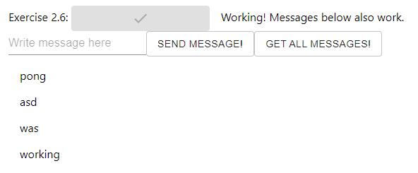

# Part 2

## 2.1
Dockerfile:
```Dockerfile
FROM devopsdockeruh/simple-web-service:alpine
```

docker-compose.yml:
```yml
version: '3.8'

services:
        simple-web-service:
                image: devopsdockeruh/simple-web-service
                build: .
                volumes:
                        - ./text.log:/usr/src/app/text.log
                container_name: simple-web
```

## 2.2

Dockerfile:
```Dockerfile
FROM devopsdockeruh/simple-web-service:alpine
```

docker-compose.yml:
```yml
version: '3.8'

services:
        simple-web-service:
                image: devopsdockeruh/simple-web-service
                ports:
                        - 8080:8080
                build: .
                volumes:
                        - ./text.log:/usr/src/app/text.log
                container_name: simple-web
                command: ["server"]
```

## 2.3
Folder 1.12 has the frontend implementation from earlier and
folder 1.13 has the backed implementation from earlier.

docker-compose.yml
```yml
version: '3.8'

services:
        frontend-service:
                build:
                        dockerfile: Dockerfile
                        context: ./1.12
                container_name: frontend
                ports:
                        - "5000:5000"
        backend-service:
                build:
                        dockerfile: Dockerfile
                        context: ./1.13
                container_name: backend
                ports:
                        - "8080:8080"
```

## 2.4

docker-compose.yml
```yml
version: '3.8'

services:
        frontend-service:
                build:
                        dockerfile: Dockerfile
                        context: ./1.12
                container_name: frontend
                ports:
                        - "5000:5000"
        backend-service:
                build:
                        dockerfile: Dockerfile
                        context: ./1.13
                container_name: backend
                ports:
                        - "8080:8080"
                environment:
                        - REQUEST_ORIGIN=http://127.0.0.1:5000
                        - REDIS_HOST=redis
        redis:
                image: redis
```

website:


## 2.5
command used after cloning:
```bash
$ docker-compose up --scale compute=3
```
BTW, I managed to get green result even without the scaling but of course the scaling made it faster :)

## 2.6

docker-compose.yml:
```yml
version: '3.8'

services:
        frontend-service:
                build:
                        dockerfile: Dockerfile
                        context: ./1.12
                container_name: frontend
                ports:
                        - "5000:5000"
        backend-service:
                build:
                        dockerfile: Dockerfile
                        context: ./1.13
                container_name: backend
                ports:
                        - "8080:8080"
                environment:
                        - REQUEST_ORIGIN=http://127.0.0.1:5000
                        - REDIS_HOST=redis
                        - POSTGRES_USER=postgres
                        - POSTGRES_PASSWORD=postgres
                        - POSTGRES_DATABASE=postgres
                        - POSTGRES_HOST=db
        redis:
                image: redis
        db:
                image: postgres:13.2-alpine
                restart: unless-stopped
                environment:
                        - POSTGRES_PASSWORD=postgres
                depends_on:
                        - backend-service
                container_name: postgres_db
```

website:


## 2.7

docker-compose.yml:
```yml
version: '3.8'

services:
        front:
                build: ./ml-kurkkumopo-frontend
                ports:
                        - "3000:3000"
        back:
                build: ./ml-kurkkumopo-backend
                ports:
                        - "5000:5000"
                volumes:
                        - model:/src/model
        training:
                build: ./ml-kurkkumopo-training
                volumes:
                        - imgs:/src/imgs
                        - model:/src/model
volumes:
        model:
        imgs:
```

website:


## 2.8

docker-compose.yml:
```yml
version: '3.8'

services:
        frontend-service:
                build:
                        dockerfile: Dockerfile
                        context: ./1.12
                container_name: frontend
                ports:
                        - "5000:5000"
        backend-service:
                build:
                        dockerfile: Dockerfile
                        context: ./1.13
                container_name: backend
                ports:
                        - "8080:8080"
                environment:
                        - REQUEST_ORIGIN=http://127.0.0.1:5000
                        - REDIS_HOST=redis
                        - POSTGRES_USER=postgres
                        - POSTGRES_PASSWORD=postgres
                        - POSTGRES_DATABASE=postgres
                        - POSTGRES_HOST=db
        redis:
                image: redis
        db:
                image: postgres:13.2-alpine
                restart: unless-stopped
                environment:
                        - POSTGRES_PASSWORD=postgres
                depends_on:
                        - backend-service
                container_name: postgres_db
        web:
                image: reverseproxy
                restart: always
                ports:
                        - "80:80"
```

Did not get the ```nginx.conf``` working from ```docker-copose.yml``` ```volumes```. Had to do the configuration in to its own image first ```reverseproxy```.

Dockerfile for ```reverseproxy```:
```Dorkerfile
FROM nginx:alpine
COPY ./nginx.conf /etc/nginx/nginx.conf
```

website:


## 2.9

docker-compose.yml:
```yml
version: '3.8'

services:
        frontend-service:
                build:
                        dockerfile: Dockerfile
                        context: ./1.12
                container_name: frontend
                ports:
                        - "5000:5000"
        backend-service:
                build:
                        dockerfile: Dockerfile
                        context: ./1.13
                container_name: backend
                ports:
                        - "8080:8080"
                environment:
                        - REQUEST_ORIGIN=http://127.0.0.1:5000
                        - REDIS_HOST=redis
                        - POSTGRES_USER=postgres
                        - POSTGRES_PASSWORD=postgres
                        - POSTGRES_DATABASE=postgres
                        - POSTGRES_HOST=db
        redis:
                image: redis
        db:
                image: postgres:13.2-alpine
                restart: unless-stopped
                volumes:
                        - ./database:/var/lib/postgresql/data
                environment:
                        - POSTGRES_PASSWORD=postgres
                depends_on:
                        - backend-service
                container_name: postgres_db
```

## 2.10

docker-compose.yml:
```yml
version: '3.8'

services:
        frontend-service:
                build:
                        dockerfile: Dockerfile
                        context: ./1.12
                container_name: frontend
                ports:
                        - "5000:5000"
        backend-service:
                build:
                        dockerfile: Dockerfile
                        context: ./1.13
                container_name: backend
                ports:
                        - "8080:8080"
                environment:
                        - REQUEST_ORIGIN=http://localhost
                        - REDIS_HOST=redis
                        - POSTGRES_USER=postgres
                        - POSTGRES_PASSWORD=postgres
                        - POSTGRES_DATABASE=postgres
                        - POSTGRES_HOST=db
        redis:
                image: redis
        db:
                image: postgres:13.2-alpine
                restart: unless-stopped
                volumes:
                        - ./database:/var/lib/postgresql/data
                environment:
                        - POSTGRES_PASSWORD=postgres
                depends_on:
                        - backend-service
                container_name: postgres_db
        web:
                image: reverseproxy
                restart: always
                ports:
                       - "80:80"
```

Docker file for frontend:
```Dockerfile
FROM ubuntu
EXPOSE 5000
ENV REACT_APP_BACKEND_URL=http://127.0.0.1:8080/

WORKDIR ./usr/src/app

RUN apt-get update
RUN apt-get install -y curl
RUN curl -sL https://deb.nodesource.com/setup_16.x | bash
RUN apt-get install -y nodejs

COPY ./example-frontend .

RUN npm install
RUN npm run build
RUN npm install -g serve

CMD ["serve", "-s", "-l", "5000", "build"]
```

Dockerfile for backend:
```Dockerfile
FROM golang:1.16
EXPOSE 8080

ENV REQUEST_ORIGIN=http://127.0.0.1:5000/

WORKDIR /usr/src/app

COPY . .

RUN go build

RUN test ./..

CMD ["./server"]
```

All I cahnged for this exercise was:
  * In ```docker-compose.yml``` backend-service environment the ```REQUEST_ORIGIN``` to ```http://localhost```.
  * Access site from ```http://localhost```

## 2.11

I'll use my one skip here as, I don't really have any good project for this :)